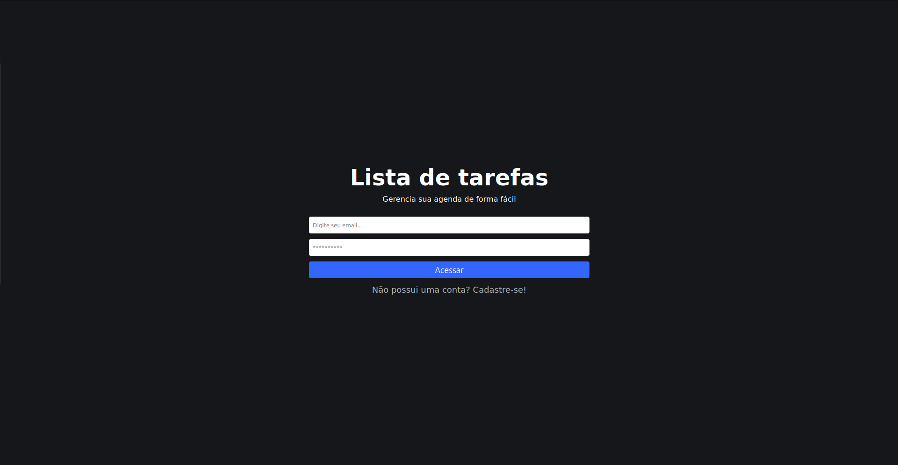
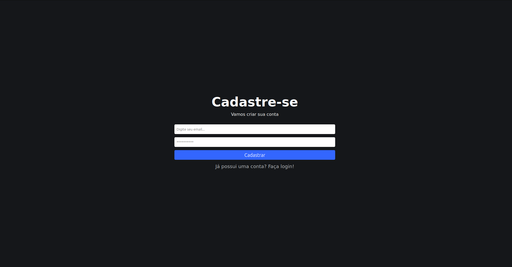
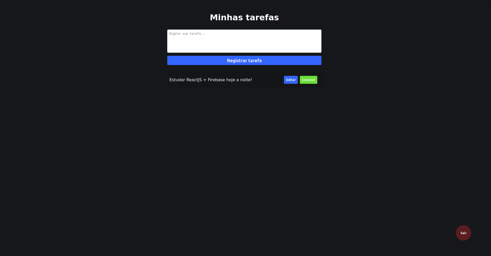

# Projeto To-Do List em ReactJS e Firebase

Este é um projeto desenvolvido em ReactJS e Firebase para criar um sistema de registro de tarefas (to-do list). Ele permite que os usuários cadastrem suas tarefas, as gerenciem e as acompanhem através de uma interface amigável.

## Instalação

Antes de executar o projeto, é necessário ter o Node.js e o npm instalados em sua máquina. Caso ainda não tenha, você pode baixá-los e instalá-los através do site oficial do [Node.js](https://nodejs.org/).

Após instalar o Node.js, siga os passos abaixo:

1. Clone este repositório para o seu computador usando o seguinte comando:

```bash
git clone https://github.com/israelsilva282/react-tasks.git
```

2. Navegue até o diretório do projeto:

```bash
cd react-tasks
```

3. Instale as dependências do projeto:

```bash
npm install
```

## Execução

Caso queira adicionar seu próprio banco de dados Firebase, acesse o site, crie um novo projeto, e copie as informações de configuração no arquivo firebaseConnection.js, localizado na pasta "src/".

Após isso, inicie o ambiente de desenvolvimento da seguinte maneira:

```bash
npm start
```

O comando acima irá iniciar o servidor de desenvolvimento e o projeto estará disponível no navegador através do endereço http://localhost:3000.

## Telas e rotas

A seguir, estão as rotas do site com suas respectivas descrições:

1. /
   

   Nesta página, os usuários poderão efetuar o login em suas contas para acessar a área de administração e gerenciar suas tarefas.

2. /register
   

   Aqui, os usuários podem se cadastrar para criar uma conta no sistema e utilizar a funcionalidade de registro de tarefas.

3. /admin
   

   Essa é a página onde os usuários autenticados poderão adicionar, remover, listar e editar suas tarefas.
